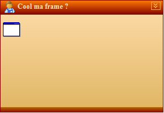



## Nice Frame

### Description

This user control is a replacement for the VB frame control.This is not a direct replacement because some of the property names are different.

The control have a header and a footer.Independent on one another you can set their look, size, text it will contain and you can also set images in the header. Header has in addition one button can collapse or expand

You can set:

- squared or rounded shape

-5 border style

-2 different gradient types of fillings

, gradient style shape style.The control exposes 3 properties to this affect: BorderStyle, FillStyle and ShapeStyle.

SEE SCREENSHOT

If you are not currently involved in the coding contest, I WOULD REALLY APPRECIATE YOU VOTING FOR MY CODE. Will only take a minute or two to make an account, and while it won't make me any money... =) it will encourage me to keep posting code and controls like this one.
 
### More Info
 

             |
---                |---
**Submitted On**   |2005-02-02 11:42:54
**By**             |[Flex dit Tannos](https://github.com/Planet-Source-Code/PSCIndex/blob/master/ByAuthor/flex-dit-tannos.md)
**Level**          |Intermediate
**User Rating**    |4.7 (151 globes from 32 users)
**Compatibility**  |VB 5\.0, VB 6\.0
**Category**       |[Custom Controls/ Forms/  Menus](https://github.com/Planet-Source-Code/PSCIndex/blob/master/ByCategory/custom-controls-forms-menus__1-4.md)
**World**          |[Visual Basic](https://github.com/Planet-Source-Code/PSCIndex/blob/master/ByWorld/visual-basic.md)
**Archive File**   |[Nice\_Frame184812242005\.zip](https://github.com/Planet-Source-Code/flex-dit-tannos-nice-frame__1-58644/archive/master.zip)

